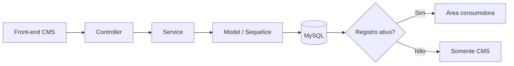
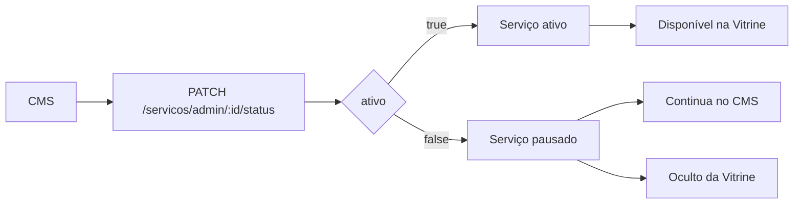
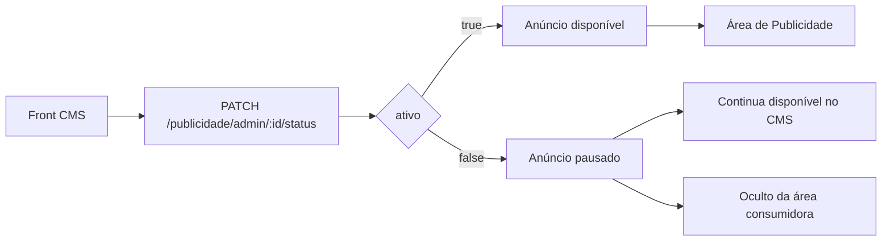

# CMS --- Serviços e Publicidade

> **Issue 1.5 --- Implementação do CMS de Serviços e Anúncios**
>
> Documento de integração destinado principalmente ao Front-end. O
> objetivo é apresentar o contrato funcional da API, exemplos de consumo
> e os fluxos implementados e validados.

------------------------------------------------------------------------

## 1. Objetivo

A implementação disponibiliza o gerenciamento de **Serviços** e
**Publicidade/Anúncios** pelo CMS.

Para os dois recursos, o CMS permite:

-   cadastrar;
-   listar;
-   consultar um registro específico;
-   editar;
-   ativar/inativar;
-   excluir.

Além das rotas administrativas, existem rotas destinadas às áreas
consumidoras da aplicação. Nessas rotas, a própria API retorna **somente
registros ativos**.

## 2. Visão geral da integração



### Regra principal de consumo

  Contexto           Comportamento
  ------------------ ----------------------------------------------
  CMS (`/admin`)     Retorna registros ativos e inativos
  Área consumidora   Retorna somente registros com `ativo = true`

**Importante:** o Front-end das vitrines/áreas consumidoras não precisa
filtrar manualmente registros inativos. Esse filtro já é realizado pelo
Back-end.

## 3. URL local utilizada nos testes

``` text
http://localhost:3333
```

A URL base deverá ser substituída pela URL correspondente ao ambiente
utilizado pela aplicação.

------------------------------------------------------------------------

# 4. Serviços

## 4.1 Estrutura do objeto

``` json
{
  "id": 1,
  "nome": "Consultoria Contábil",
  "descricao": "Serviço de consultoria contábil para empresas.",
  "valorBase": "350.00",
  "prazoEstimadoDias": 5,
  "ativo": true
}
```

  -----------------------------------------------------------------------
  Campo                   Tipo                    Descrição
  ----------------------- ----------------------- -----------------------
  `id`                    number                  Identificador do
                                                  serviço

  `nome`                  string                  Nome apresentado na
                                                  Vitrine

  `descricao`             string/null             Descrição do serviço

  `valorBase`             decimal                 Valor base/honorário

  `prazoEstimadoDias`     number/null             Prazo estimado em dias

  `ativo`                 boolean                 Define se o serviço
                                                  está disponível na área
                                                  consumidora
  -----------------------------------------------------------------------

No banco existem campos em `snake_case`, como `valor_base` e
`prazo_estimado_dias`. A API expõe esses campos em `camelCase` como
`valorBase` e `prazoEstimadoDias`.

## 4.2 Listar serviços disponíveis para a Vitrine

``` http
GET /servicos
```

Retorna **somente serviços ativos**.

``` javascript
const response = await fetch(`${API_URL}/servicos`);
const servicos = await response.json();
```

Um serviço com `ativo: false` não será retornado por este endpoint.

## 4.3 Listar serviços no CMS

``` http
GET /servicos/admin
```

Retorna todos os serviços cadastrados, ativos e pausados/inativos. Este
é o endpoint recomendado para a listagem administrativa.

## 4.4 Buscar serviço por ID

``` http
GET /servicos/admin/:id
```

Exemplo:

``` http
GET /servicos/admin/1
```

Pode ser utilizado para carregar um serviço em uma tela/formulário de
edição. Caso o ID não exista, a API retorna `404 Not Found`.

## 4.5 Cadastrar serviço

``` http
POST /servicos/admin
```

``` json
{
  "nome": "Consultoria Contábil",
  "descricao": "Serviço de consultoria contábil para empresas.",
  "valorBase": 350.00,
  "prazoEstimadoDias": 5
}
```

O serviço é criado ativo por padrão.

### Atenção ao `valorBase`

No envio de `POST` e `PATCH`, `valorBase` deve ser enviado como
**number**, sem aspas.

Correto:

``` json
{ "valorBase": 350.00 }
```

Incorreto:

``` json
{ "valorBase": "350.00" }
```

O tipo incorreto é rejeitado com `400 Bad Request`.

## 4.6 Editar serviço

``` http
PATCH /servicos/admin/:id
```

A edição é parcial:

``` json
{
  "nome": "Consultoria Contábil Empresarial",
  "valorBase": 450.00
}
```

Os campos não enviados permanecem inalterados.

## 4.7 Ativar ou pausar serviço

``` http
PATCH /servicos/admin/:id/status
```

Pausar:

``` json
{ "ativo": false }
```

Reativar:

``` json
{ "ativo": true }
```

`ativo` deve ser um **boolean JSON real**, e não `"true"` ou `"false"`
como string.



Um serviço pausado continua em `GET /servicos/admin`, mas deixa de
aparecer em `GET /servicos`. Ao ser reativado, volta automaticamente à
Vitrine.

## 4.8 Excluir serviço

``` http
DELETE /servicos/admin/:id
```

Após a exclusão, uma consulta ao mesmo ID deve retornar `404 Not Found`.

------------------------------------------------------------------------

# 5. Publicidade / Anúncios

## 5.1 Estrutura do objeto

``` json
{
  "id": 1,
  "titulo": "Regularize sua empresa",
  "conteudo": "Conte com nossa equipe para manter sua empresa regularizada.",
  "urlImagem": "https://example.com/anuncio.jpg",
  "ativo": true
}
```

  -----------------------------------------------------------------------
  Campo                   Tipo                    Descrição
  ----------------------- ----------------------- -----------------------
  `id`                    number                  Identificador do
                                                  anúncio

  `titulo`                string                  Título do anúncio

  `conteudo`              string                  Conteúdo textual

  `urlImagem`             string/null             URL da imagem

  `ativo`                 boolean                 Define se o anúncio
                                                  está disponível na área
                                                  consumidora
  -----------------------------------------------------------------------

Na API é utilizado `urlImagem`; o mapeamento para `url_imagem` no banco
é realizado pelo Back-end.

Limites utilizados pela API:

-   `titulo`: até **150 caracteres**;
-   `urlImagem`: até **191 caracteres**.

## 5.2 Listar anúncios ativos

``` http
GET /publicidade
```

Retorna somente anúncios com `ativo = true`. Deve ser utilizado pela
área consumidora de Publicidade.

## 5.3 Listar anúncios no CMS

``` http
GET /publicidade/admin
```

Retorna anúncios ativos e pausados.

## 5.4 Buscar anúncio por ID

``` http
GET /publicidade/admin/:id
```

Caso o anúncio não exista, retorna `404 Not Found`.

## 5.5 Cadastrar anúncio

``` http
POST /publicidade/admin
```

``` json
{
  "titulo": "Regularize sua empresa",
  "conteudo": "Conte com nossa equipe para manter sua empresa regularizada.",
  "urlImagem": "https://example.com/anuncio.jpg"
}
```

O anúncio é criado ativo por padrão.

## 5.6 Editar anúncio

``` http
PATCH /publicidade/admin/:id
```

A edição é parcial:

``` json
{
  "titulo": "Regularize sua empresa agora"
}
```

## 5.7 Ativar ou pausar anúncio

``` http
PATCH /publicidade/admin/:id/status
```

Pausar:

``` json
{ "ativo": false }
```

Reativar:

``` json
{ "ativo": true }
```



## 5.8 Excluir anúncio

``` http
DELETE /publicidade/admin/:id
```

Após a exclusão, a consulta pelo ID deve retornar `404 Not Found`.

------------------------------------------------------------------------

# 6. Resumo dos endpoints

## Serviços

  Método     Endpoint                       Uso
  ---------- ------------------------------ --------------------------------------
  `GET`      `/servicos`                    Lista serviços ativos para a Vitrine
  `GET`      `/servicos/admin`              Lista todos os serviços no CMS
  `GET`      `/servicos/admin/:id`          Busca serviço específico
  `POST`     `/servicos/admin`              Cadastra serviço
  `PATCH`    `/servicos/admin/:id`          Edita serviço
  `PATCH`    `/servicos/admin/:id/status`   Ativa/pausa serviço
  `DELETE`   `/servicos/admin/:id`          Exclui serviço

## Publicidade

  Método     Endpoint                          Uso
  ---------- --------------------------------- --------------------------------
  `GET`      `/publicidade`                    Lista anúncios ativos
  `GET`      `/publicidade/admin`              Lista todos os anúncios no CMS
  `GET`      `/publicidade/admin/:id`          Busca anúncio específico
  `POST`     `/publicidade/admin`              Cadastra anúncio
  `PATCH`    `/publicidade/admin/:id`          Edita anúncio
  `PATCH`    `/publicidade/admin/:id/status`   Ativa/pausa anúncio
  `DELETE`   `/publicidade/admin/:id`          Exclui anúncio

# 7. Status HTTP relevantes

  -----------------------------------------------------------------------
  Status                              Significado para integração
  ----------------------------------- -----------------------------------
  `200 OK`                            Consulta ou alteração realizada com
                                      sucesso

  `201 Created`                       Registro criado com sucesso

  `400 Bad Request`                   Payload inválido ou tipo de dado
                                      incorreto

  `404 Not Found`                     Serviço/anúncio solicitado não
                                      existe

  `500 Internal Server Error`         Erro interno que deve ser
                                      investigado no Back-end
  -----------------------------------------------------------------------

# 8. Fluxo recomendado no Front-end

Para telas administrativas:

``` text
Abrir CMS
   ↓
GET /recurso/admin
   ↓
Listar ativos + pausados
   ↓
Cadastrar / Editar / Ativar-Pausar / Excluir
POST        PATCH       PATCH status     DELETE
```

Para áreas consumidoras:

``` text
Abrir Vitrine / Publicidade
            ↓
GET /servicos ou /publicidade
            ↓
API aplica ativo = true
            ↓
Front recebe somente registros disponíveis
```

# 9. Referências no Back-end

## Serviços

-   `src/modules/cms/servicos/servico.model.ts` --- mapeamento do
    Serviço e campos do banco.
-   `src/modules/cms/servicos/dto/` --- formatos e validações dos dados
    recebidos.
-   `src/modules/cms/servicos/servicos.controller.ts` --- endpoints
    disponíveis.
-   `src/modules/cms/servicos/servicos.service.ts` --- regras de
    listagem, cadastro, edição, status e exclusão.

## Publicidade

-   `src/modules/cms/publicidade/publicidade.model.ts` --- mapeamento de
    Publicidade.
-   `src/modules/cms/publicidade/dto/` --- formatos e validações.
-   `src/modules/cms/publicidade/publicidade.controller.ts` ---
    endpoints disponíveis.
-   `src/modules/cms/publicidade/publicidade.service.ts` --- regras
    funcionais.

Para integração pelo Front-end, as referências mais úteis são
**Controller**, **DTOs** e este documento.

# 10. Validações realizadas

A implementação foi validada localmente utilizando o schema oficial do
projeto e testes HTTP.

Foram verificados:

-   build do Back-end;
-   inicialização da aplicação NestJS;
-   conexão Sequelize → MySQL;
-   Models alinhados às tabelas `servico` e `publicidade`;
-   listagem da área consumidora;
-   listagem administrativa;
-   consulta por ID;
-   retorno `404` para registro inexistente;
-   cadastro;
-   edição parcial;
-   ativação e inativação;
-   permanência de registros inativos no CMS;
-   ocultação de registros inativos nas áreas consumidoras;
-   reexibição após reativação;
-   exclusão;
-   retorno `404` após exclusão.

# 11. Observações para integração

1.  Rotas contendo `/admin` são destinadas ao gerenciamento pelo CMS.
2.  As rotas consumidoras já filtram registros inativos.
3.  Não é necessário realizar filtro adicional de `ativo` na
    Vitrine/área de Publicidade.
4.  `valorBase` deve ser enviado como `number`.
5.  `ativo` deve ser enviado como `boolean`.
6.  Os endpoints `PATCH` de edição aceitam alterações parciais.
7.  O ID retornado pela API deve ser utilizado nas operações de
    consulta, edição, alteração de status e exclusão.
8.  Alterações estruturais no banco seguem o processo de migrations do
    projeto de banco de dados.

------------------------------------------------------------------------

## Status da implementação

**Serviços:** implementado e validado.\
**Publicidade/Anúncios:** implementado e validado.\
**Build:** validado.\
**Integração com banco local/schema oficial:** validada.\
**Endpoints CRUD e controle de status:** validados.
